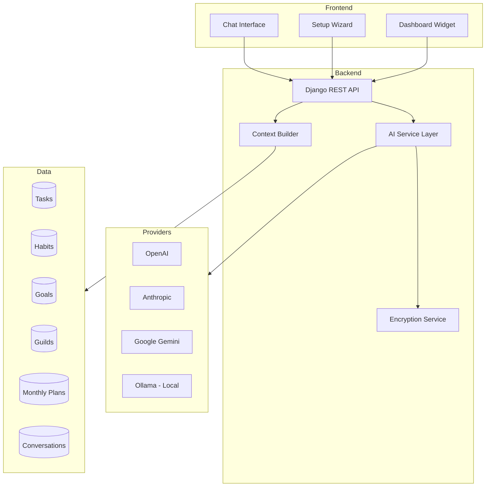
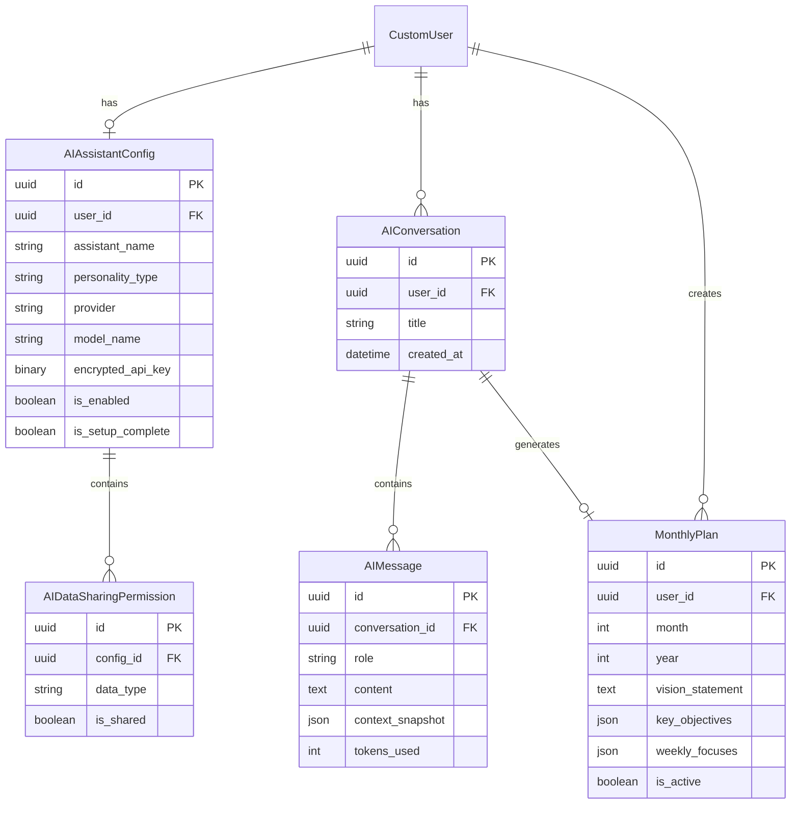

# Mira - AI Productivity Assistant for Minsoto

> **Feature Name:** **Mira** (Mindful Intelligent Reflection Assistant)  
> *Mira means "wonderful" in Latin and "look/see" in Spanish, perfect for an assistant that helps you see your path to productivity.*

## Overview

Mira is a context-aware AI productivity assistant that integrates deeply with Minsoto's productivity ecosystem. Users can share selected data (tasks, habits, goals, guild activities) with Mira, choose from distinct personality types, and optionally create/update monthly personal development plans.

### Key Features
- **Context-Aware Conversations**: AI has access to user-selected productivity data
- **Customizable Personality Types**: Mentor, Assistant, Motivational Buddy, Goth Baddie, etc.
- **Monthly Planning**: AI-guided monthly goal setting with progress tracking
- **BYOK (Bring Your Own Key)**: Users provide their own API keys for AI providers
- **Enterprise-Grade Security**: Encrypted API key storage with AES-256

---

## User Review Required

> [!IMPORTANT]
> **Feature Name Decision**: The proposed name is **"Mira"**. Alternative options:
> - **Zen** (aligns with Minsoto's mindfulness theme)
> - **Sage** (wisdom/guidance connotation)
> - **Compass** (navigation/direction theme)
> - **Echo** (reflection theme)

> [!WARNING]
> **Security Considerations**: API keys will be encrypted using Fernet (AES-128-CBC). For production, consider:
> - Using a dedicated secrets manager (AWS Secrets Manager, HashiCorp Vault)
> - Hardware Security Module (HSM) for key management
> - Key rotation policies

> [!CAUTION]
> **No Built-in AI Access**: As specified, users must provide their own API keys. The "Minsoto API" option is a premium placeholder for future monetization but will not function initially.

---

## Architecture Overview



---

## Proposed Changes

### Backend - Django App: `ai_assistant`

---

#### [NEW] [app.py](file:///c:/Users/ChaitanyaAnand/Documents/GitHub/Minsoto/minsoto-backend/ai_assistant/apps.py)

Standard Django app configuration.

---

#### [NEW] [models.py](file:///c:/Users/ChaitanyaAnand/Documents/GitHub/Minsoto/minsoto-backend/ai_assistant/models.py)

New models for AI assistant functionality:

**1. `AIAssistantConfig`** - User's AI configuration
```python
class AIAssistantConfig(models.Model):
    """User's AI assistant configuration and preferences."""
    
    PERSONALITY_CHOICES = [
        ('mentor', 'Mentor'),           # Wise, patient, educational
        ('assistant', 'Assistant'),     # Professional, efficient, task-focused
        ('buddy', 'Motivational Buddy'), # Cheerful, encouraging, supportive
        ('goth', 'Goth Baddie'),        # Dark humor, sarcastic but helpful
        ('zen', 'Zen Master'),          # Calm, philosophical, mindful
        ('coach', 'Life Coach'),        # Goal-oriented, challenging, direct
        ('scientist', 'Mad Scientist'), # Analytical, quirky, data-driven
    ]
    
    PROVIDER_CHOICES = [
        ('openai', 'OpenAI'),
        ('anthropic', 'Anthropic'),
        ('google', 'Google Gemini'),
        ('ollama', 'Ollama (Local)'),
        ('minsoto', 'Minsoto API'),  # Future premium option
    ]
    
    id = models.UUIDField(primary_key=True, default=uuid.uuid4)
    user = models.OneToOneField(settings.AUTH_USER_MODEL, on_delete=models.CASCADE)
    
    # Personality & Display
    assistant_name = models.CharField(max_length=50, default='Mira')
    personality_type = models.CharField(max_length=20, choices=PERSONALITY_CHOICES, default='assistant')
    
    # API Configuration (encrypted)
    provider = models.CharField(max_length=20, choices=PROVIDER_CHOICES, default='openai')
    model_name = models.CharField(max_length=100, default='gpt-4o-mini')
    encrypted_api_key = models.BinaryField(null=True, blank=True)  # Fernet encrypted
    
    # Feature flags
    is_enabled = models.BooleanField(default=False)
    is_setup_complete = models.BooleanField(default=False)
    
    created_at = models.DateTimeField(auto_now_add=True)
    updated_at = models.DateTimeField(auto_now=True)
```

**2. `AIDataSharingPermission`** - Per-data-type sharing settings
```python
class AIDataSharingPermission(models.Model):
    """Controls what data the AI can access."""
    
    DATA_TYPE_CHOICES = [
        ('tasks', 'Tasks'),
        ('habits', 'Habits'),
        ('goals', 'Goals'),
        ('posts', 'Posts'),
        ('guilds', 'Guild Memberships'),
        ('guild_tasks', 'Guild Tasks'),
        ('guild_habits', 'Guild Habits'),
        ('monthly_plans', 'Monthly Plans'),
        ('achievements', 'Achievements & XP'),
    ]
    
    config = models.ForeignKey(AIAssistantConfig, on_delete=models.CASCADE)
    data_type = models.CharField(max_length=30, choices=DATA_TYPE_CHOICES)
    is_shared = models.BooleanField(default=False)
    
    class Meta:
        unique_together = ['config', 'data_type']
```

**3. `AIConversation`** - Chat session container
```python
class AIConversation(models.Model):
    """A conversation thread with the AI assistant."""
    
    id = models.UUIDField(primary_key=True, default=uuid.uuid4)
    user = models.ForeignKey(settings.AUTH_USER_MODEL, on_delete=models.CASCADE)
    title = models.CharField(max_length=200, blank=True)  # Auto-generated from first message
    
    created_at = models.DateTimeField(auto_now_add=True)
    updated_at = models.DateTimeField(auto_now=True)
```

**4. `AIMessage`** - Individual messages
```python
class AIMessage(models.Model):
    """Individual message in a conversation."""
    
    ROLE_CHOICES = [
        ('user', 'User'),
        ('assistant', 'Assistant'),
        ('system', 'System'),
    ]
    
    id = models.UUIDField(primary_key=True, default=uuid.uuid4)
    conversation = models.ForeignKey(AIConversation, on_delete=models.CASCADE)
    role = models.CharField(max_length=10, choices=ROLE_CHOICES)
    content = models.TextField()
    
    # Context snapshot (what data was available when message was sent)
    context_snapshot = models.JSONField(null=True, blank=True)
    
    # Token usage tracking
    tokens_used = models.PositiveIntegerField(default=0)
    
    created_at = models.DateTimeField(auto_now_add=True)
```

**5. `MonthlyPlan`** - AI-assisted monthly planning
```python
class MonthlyPlan(models.Model):
    """Monthly development plan created with AI assistance."""
    
    id = models.UUIDField(primary_key=True, default=uuid.uuid4)
    user = models.ForeignKey(settings.AUTH_USER_MODEL, on_delete=models.CASCADE)
    
    month = models.PositiveIntegerField()  # 1-12
    year = models.PositiveIntegerField()
    
    # Plan content (structured JSON)
    vision_statement = models.TextField()  # "By end of month, I want to..."
    key_objectives = models.JSONField(default=list)  # [{title, description, target, progress}]
    weekly_focuses = models.JSONField(default=dict)  # {week1: [...], week2: [...]}
    habits_to_build = models.JSONField(default=list)
    habits_to_break = models.JSONField(default=list)
    
    # AI interaction log
    creation_conversation = models.ForeignKey(AIConversation, null=True, on_delete=models.SET_NULL)
    
    # Progress tracking
    mid_month_review = models.TextField(blank=True)
    end_month_reflection = models.TextField(blank=True)
    
    is_active = models.BooleanField(default=True)
    created_at = models.DateTimeField(auto_now_add=True)
    updated_at = models.DateTimeField(auto_now=True)
    
    class Meta:
        unique_together = ['user', 'month', 'year']
```

---

#### [NEW] [encryption.py](file:///c:/Users/ChaitanyaAnand/Documents/GitHub/Minsoto/minsoto-backend/ai_assistant/encryption.py)

Secure encryption utilities for API keys:

```python
from cryptography.fernet import Fernet
from django.conf import settings
import base64

def get_fernet():
    """Get Fernet instance using secret key."""
    # Derive a 32-byte key from Django's SECRET_KEY
    key = base64.urlsafe_b64encode(
        settings.SECRET_KEY[:32].encode().ljust(32, b'0')
    )
    return Fernet(key)

def encrypt_api_key(api_key: str) -> bytes:
    """Encrypt an API key for storage."""
    f = get_fernet()
    return f.encrypt(api_key.encode())

def decrypt_api_key(encrypted_key: bytes) -> str:
    """Decrypt a stored API key."""
    f = get_fernet()
    return f.decrypt(encrypted_key).decode()
```

---

#### [NEW] [context_builder.py](file:///c:/Users/ChaitanyaAnand/Documents/GitHub/Minsoto/minsoto-backend/ai_assistant/context_builder.py)

Service to build context from user's shared data:

```python
class AIContextBuilder:
    """Builds context from user's productivity data for AI conversations."""
    
    def __init__(self, user, permissions: list[AIDataSharingPermission]):
        self.user = user
        self.permissions = {p.data_type: p.is_shared for p in permissions}
    
    def build_context(self) -> dict:
        """Build complete context based on permissions."""
        context = {}
        
        if self.permissions.get('tasks'):
            context['tasks'] = self._get_tasks_context()
        if self.permissions.get('habits'):
            context['habits'] = self._get_habits_context()
        if self.permissions.get('goals'):
            context['goals'] = self._get_goals_context()
        # ... etc for other data types
        
        return context
    
    def _get_tasks_context(self) -> dict:
        """Get summarized task information."""
        from productivity.models import Task
        tasks = Task.objects.filter(user=self.user)
        return {
            'total': tasks.count(),
            'completed_today': tasks.filter(status='completed', updated_at__date=date.today()).count(),
            'overdue': tasks.filter(due_date__lt=now(), status__in=['todo', 'in_progress']).count(),
            'high_priority_pending': list(tasks.filter(status='todo', priority='high').values('title', 'due_date')[:5]),
        }
    
    # Similar methods for habits, goals, guilds, etc.
```

---

#### [NEW] [ai_service.py](file:///c:/Users/ChaitanyaAnand/Documents/GitHub/Minsoto/minsoto-backend/ai_assistant/ai_service.py)

AI provider abstraction layer:

```python
from abc import ABC, abstractmethod
import openai
import anthropic

class AIProvider(ABC):
    @abstractmethod
    def chat(self, messages: list[dict], system_prompt: str) -> str:
        pass

class OpenAIProvider(AIProvider):
    def __init__(self, api_key: str, model: str = 'gpt-4o-mini'):
        self.client = openai.OpenAI(api_key=api_key)
        self.model = model
    
    def chat(self, messages: list[dict], system_prompt: str) -> str:
        response = self.client.chat.completions.create(
            model=self.model,
            messages=[{"role": "system", "content": system_prompt}] + messages
        )
        return response.choices[0].message.content

class AnthropicProvider(AIProvider):
    def __init__(self, api_key: str, model: str = 'claude-3-sonnet-20240229'):
        self.client = anthropic.Anthropic(api_key=api_key)
        self.model = model
    
    def chat(self, messages: list[dict], system_prompt: str) -> str:
        response = self.client.messages.create(
            model=self.model,
            system=system_prompt,
            messages=messages
        )
        return response.content[0].text

# Factory function
def get_provider(config: AIAssistantConfig) -> AIProvider:
    api_key = decrypt_api_key(config.encrypted_api_key)
    
    if config.provider == 'openai':
        return OpenAIProvider(api_key, config.model_name)
    elif config.provider == 'anthropic':
        return AnthropicProvider(api_key, config.model_name)
    # ... other providers
```

---

#### [NEW] [personality.py](file:///c:/Users/ChaitanyaAnand/Documents/GitHub/Minsoto/minsoto-backend/ai_assistant/personality.py)

Personality system prompts:

```python
PERSONALITY_PROMPTS = {
    'mentor': """You are Mira, a wise and patient mentor. You guide the user with 
    thoughtful questions and help them discover insights about their productivity. 
    You speak calmly, use encouraging language, and share relevant wisdom.""",
    
    'assistant': """You are Mira, a professional productivity assistant. You are 
    efficient, organized, and task-focused. You help prioritize work, suggest 
    optimizations, and keep the user on track. Be concise and actionable.""",
    
    'buddy': """You are Mira, an enthusiastic motivational buddy! 🎉 You're always 
    positive, celebrate small wins, and help the user stay motivated. Use casual 
    language, emojis, and plenty of encouragement!""",
    
    'goth': """You are Mira, but with a dark aesthetic. You're helpful but sardonic, 
    using deadpan humor and gothic references. Despite your dark exterior, you 
    genuinely want to help. "I suppose we should tackle that task list before the 
    void consumes us all..." 🖤""",
    
    'zen': """You are Mira, a Zen-inspired guide. You approach productivity with 
    mindfulness, encouraging presence and balance. Use calming language, occasional 
    koans, and help the user find peace in their work. 🧘""",
    
    'coach': """You are Mira, a direct life coach. You challenge the user to grow, 
    ask tough questions, and hold them accountable. Be motivating but push them 
    out of their comfort zone. "What's really stopping you here?" """,
    
    'scientist': """You are Mira, a quirky data-driven scientist. You love 
    analyzing productivity patterns, suggesting experiments, and treating self-
    improvement as a fascinating research project. "Fascinating! Your task 
    completion rate increased 23% when you..." 🔬""",
}

def get_system_prompt(personality: str, context: dict) -> str:
    """Build complete system prompt with personality and context."""
    base = PERSONALITY_PROMPTS.get(personality, PERSONALITY_PROMPTS['assistant'])
    
    context_section = f"""
    
Current user context:
{json.dumps(context, indent=2, default=str)}

Use this context to provide personalized, relevant advice. Reference specific 
tasks, habits, or goals when appropriate. Help the user make progress on their 
productivity journey.
"""
    
    return base + context_section
```

---

#### [NEW] [serializers.py](file:///c:/Users/ChaitanyaAnand/Documents/GitHub/Minsoto/minsoto-backend/ai_assistant/serializers.py)

DRF serializers for all models including API key handling (input only, never output).

---

#### [NEW] [views.py](file:///c:/Users/ChaitanyaAnand/Documents/GitHub/Minsoto/minsoto-backend/ai_assistant/views.py)

API endpoints:
- `POST /api/ai/setup/` - Initial setup with API key and preferences
- `GET/PATCH /api/ai/config/` - Get/update configuration
- `POST /api/ai/chat/` - Send message, get AI response
- `GET /api/ai/conversations/` - List conversations
- `GET /api/ai/conversations/{id}/` - Get conversation with messages
- `POST /api/ai/monthly-plan/create/` - Create new monthly plan with AI
- `GET /api/ai/monthly-plan/current/` - Get current month's plan
- `PATCH /api/ai/monthly-plan/{id}/` - Update plan progress

---

#### [NEW] [urls.py](file:///c:/Users/ChaitanyaAnand/Documents/GitHub/Minsoto/minsoto-backend/ai_assistant/urls.py)

URL routing for all AI endpoints.

---

#### [MODIFY] [settings.py](file:///c:/Users/ChaitanyaAnand/Documents/GitHub/Minsoto/minsoto-backend/minsoto_backend/settings.py)

Add `ai_assistant` to `INSTALLED_APPS`.

---

#### [MODIFY] [urls.py](file:///c:/Users/ChaitanyaAnand/Documents/GitHub/Minsoto/minsoto-backend/minsoto_backend/urls.py)

Include AI assistant URLs: `path('api/ai/', include('ai_assistant.urls'))`

---

#### [MODIFY] [requirements.txt](file:///c:/Users/ChaitanyaAnand/Documents/GitHub/Minsoto/minsoto-backend/requirements.txt)

Add new dependencies:
```
cryptography>=41.0.0  # For API key encryption
openai>=1.0.0         # OpenAI provider
anthropic>=0.18.0     # Anthropic provider
google-generativeai   # Google Gemini provider (optional)
```

---

### Frontend - Next.js Components

---

#### [NEW] [aiStore.ts](file:///c:/Users/ChaitanyaAnand/Documents/GitHub/Minsoto/minsoto-frontend/src/stores/aiStore.ts)

Zustand store for AI assistant state:
- Configuration state
- Conversations list
- Current conversation messages
- Sending/loading states
- Actions: setupAI, sendMessage, fetchConfig, etc.

---

#### [NEW] [page.tsx](file:///c:/Users/ChaitanyaAnand/Documents/GitHub/Minsoto/minsoto-frontend/src/app/mira/page.tsx)

Main AI assistant chat page with:
- Conversation sidebar
- Message area with markdown rendering
- Input with suggestions
- Context indicator (what data is being shared)

---

#### [NEW] [setup/page.tsx](file:///c:/Users/ChaitanyaAnand/Documents/GitHub/Minsoto/minsoto-frontend/src/app/mira/setup/page.tsx)

Setup wizard with steps:
1. **Welcome** - Introduction to Mira
2. **Personality Selection** - Choose from personality types with previews
3. **Data Sharing** - Toggle what data to share with AI
4. **API Configuration** - Enter provider and API key
5. **Confirmation** - Summary and activation

---

#### [NEW] [settings/page.tsx](file:///c:/Users/ChaitanyaAnand/Documents/GitHub/Minsoto/minsoto-frontend/src/app/mira/settings/page.tsx)

Settings page to modify:
- Personality type
- Data sharing preferences
- API key (update/rotate)
- Model selection

---

#### [NEW] [monthly-plan/page.tsx](file:///c:/Users/ChaitanyaAnand/Documents/GitHub/Minsoto/minsoto-frontend/src/app/mira/monthly-plan/page.tsx)

Monthly planning interface:
- Vision statement input
- AI-guided objective creation
- Weekly focus breakdown
- Progress tracking dashboard

---

#### [NEW] [MiraChatWidget.tsx](file:///c:/Users/ChaitanyaAnand/Documents/GitHub/Minsoto/minsoto-frontend/src/components/widgets/MiraChatWidget.tsx)

Dashboard widget showing:
- Quick message input
- Last few messages
- Monthly plan progress snippet
- Link to full chat

---

#### [MODIFY] [Navigation.tsx](file:///c:/Users/ChaitanyaAnand/Documents/GitHub/Minsoto/minsoto-frontend/src/components/Navigation.tsx)

Add "Mira" link to navigation with sparkle icon (✨ or 🤖).

---

## Database Schema Diagram



---

## Verification Plan

### Automated Tests

1. **Encryption Tests**
   ```bash
   python manage.py test ai_assistant.tests.test_encryption
   ```
   - Verify encrypt/decrypt roundtrip
   - Test with various key lengths
   - Verify encrypted data is not readable

2. **Context Builder Tests**
   ```bash
   python manage.py test ai_assistant.tests.test_context_builder
   ```
   - Verify only shared data types are included
   - Test with various permission combinations
   - Verify data summarization logic

3. **API Endpoint Tests**
   ```bash
   python manage.py test ai_assistant.tests.test_views
   ```
   - Setup flow
   - Configuration updates
   - Chat endpoint (with mocked AI provider)
   - Monthly plan CRUD

### Manual Verification

1. **Setup Flow Walkthrough**
   - Navigate through all setup steps
   - Verify data is saved correctly
   - Test API key validation (invalid key handling)

2. **Chat Functionality**
   - Send various types of messages
   - Verify context is correctly included
   - Test personality switching

3. **Security Verification**
   - Verify API keys are never exposed in responses
   - Check network requests don't leak keys
   - Verify database stores only encrypted keys

---

## Implementation Order

| Phase | Estimated Effort | Dependencies |
|-------|-----------------|--------------|
| 1. Backend Models | 3-4 hours | None |
| 2. Encryption Service | 1 hour | Phase 1 |
| 3. AI Provider Layer | 2-3 hours | Phase 2 |
| 4. Context Builder | 2 hours | Phase 1 |
| 5. API Endpoints | 3-4 hours | Phases 1-4 |
| 6. Frontend Store | 2 hours | Phase 5 |
| 7. Setup UI | 4-5 hours | Phase 6 |
| 8. Chat UI | 4-5 hours | Phases 6-7 |
| 9. Monthly Planning | 4-5 hours | Phases 6-8 |
| 10. Dashboard Widget | 2 hours | Phases 6-8 |
| 11. Testing & Polish | 3-4 hours | All phases |

**Total Estimated Effort: 30-38 hours**

---

## Future Enhancements (Not in Scope)

- Voice interaction
- Proactive notifications ("You haven't logged your habits today!")
- Integration with calendar for scheduling
- Team/Guild AI assistants
- Usage analytics and insights
- Minsoto-hosted premium API option
